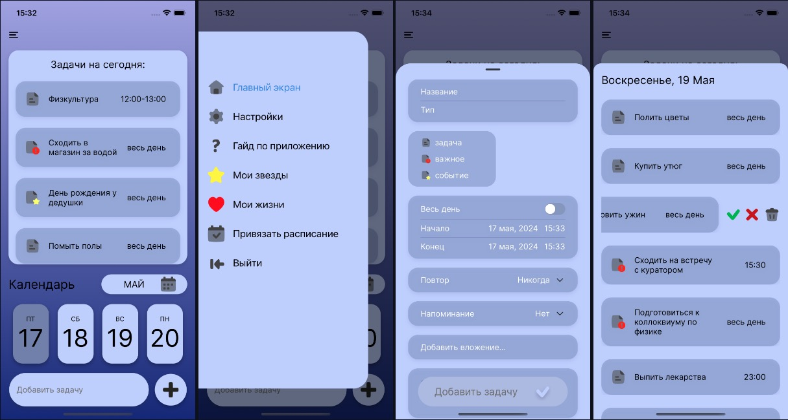

# RemindMeNow by Урфскул
Мобильное приложение, которое помогает пользователю организовать свой день, благодаря возможности добавлять задачи и расписание по учёбе, ставить напоминания

## Ссылки
[Скачать последний релиз](https://github.com/Daniil-Leshchev/RemindMeNow/releases/download/v1.0.0/RemindMeNow.apk)\
[Карточка проекта](https://project.ai-info.ru/teams/urfskul)

## Основные функции

* добавление, удаление задач
* настройки задачи: название, дата и время, повтор, напоминание, заметки
* аутентификация пользователя
* возможность синхронизировать учебное расписание для студентов УрФУ
* мотивационная система в виде жизней

## Использование приложения

